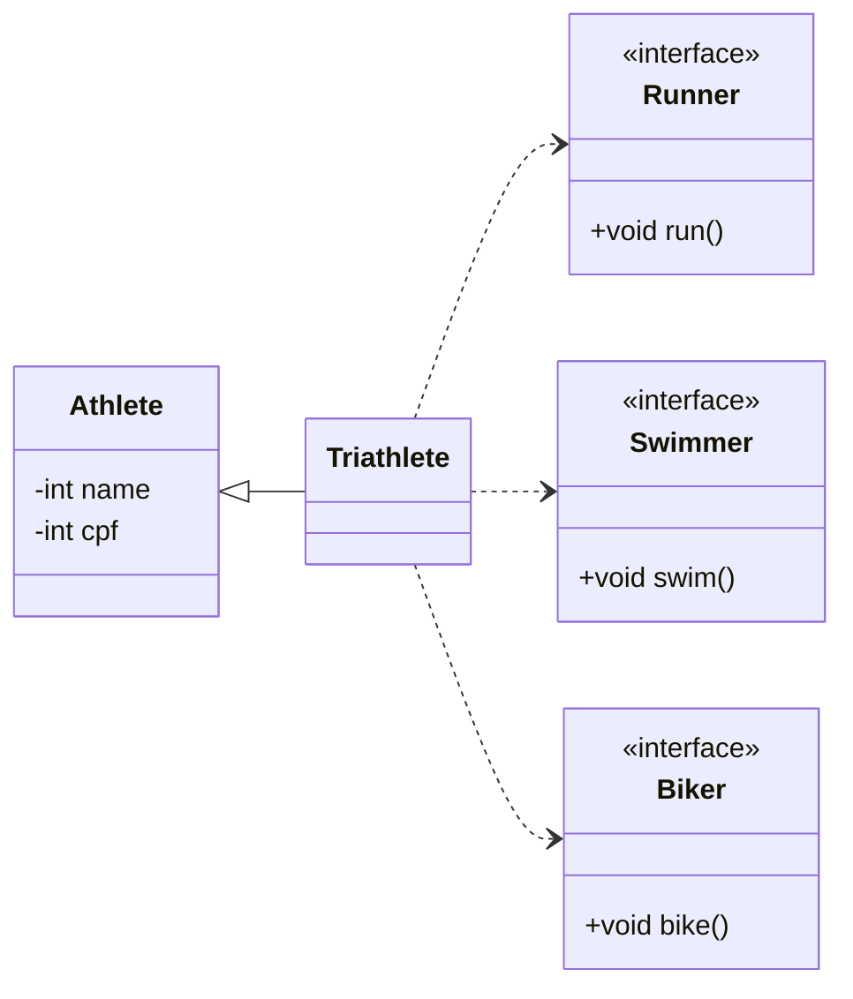

```mermaid
classDiagram
    direction LR

    Athlete <|-- Triathlete
    Triathlete ..> Runner
    Triathlete ..> Swimmer
    Triathlete ..> Biker

    class Runner{
        <<interface>>
        +void run()
    }
    class Swimmer {
        <<interface>>
        +void swim()
    }
    class Biker {
        <<interface>>
        +void bike()
    }
    class Athlete {
        -int name
        -int cpf
    }
    class Triathlete{

    }
```
