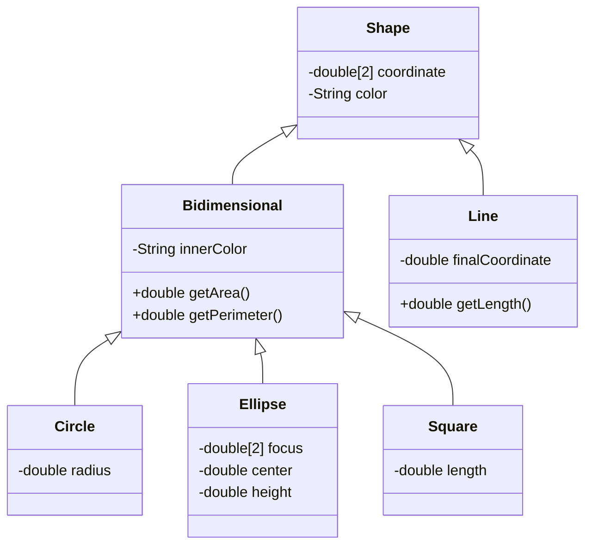

```mermaid
classDiagram
    Shape <|-- Bidimensional
    Shape <|-- Line
    Bidimensional <|-- Circle
    Bidimensional <|-- Ellipse
    Bidimensional <|-- Square

    class Shape {
      -double[2] coordinate
      -String color
    }

    class Bidimensional {
      -String innerColor
      +double getArea()
      +double getPerimeter()
    }

    class Line {
      -double finalCoordinate
      +double getLength()
    }

    class Circle {
      -double radius
    }

    class Square {
      -double length
    }

    class Ellipse {
      -double[2] focus
      -double center
      -double height
    }

```
